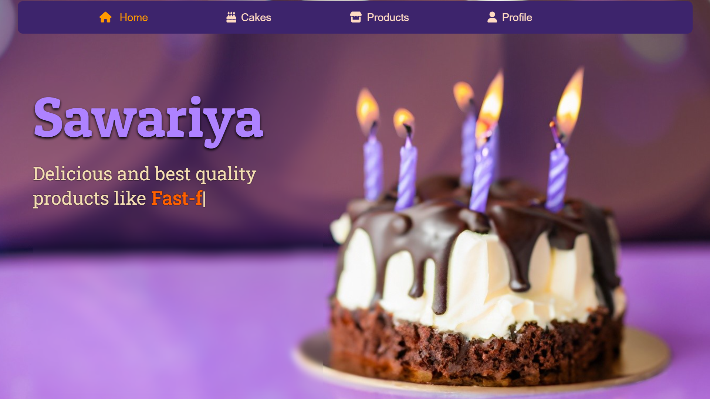
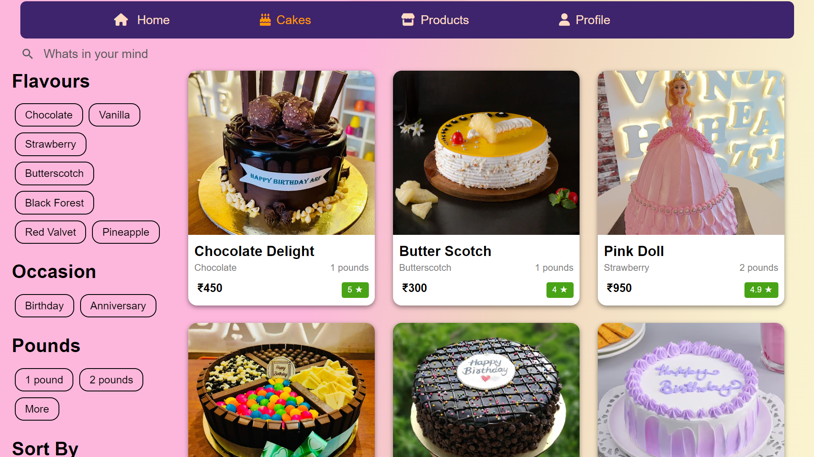
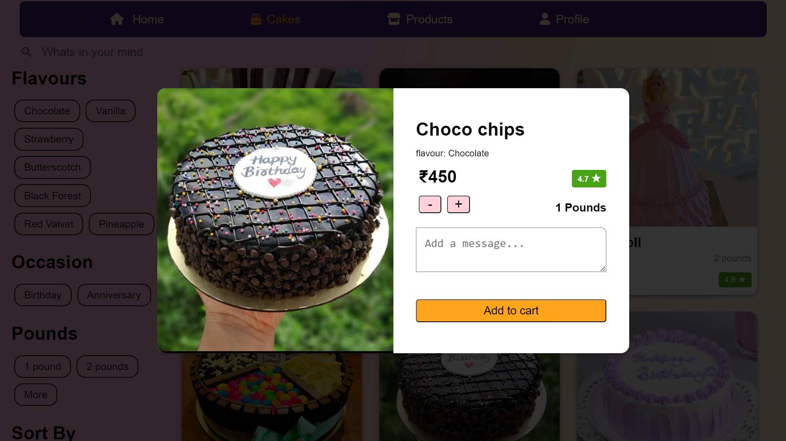
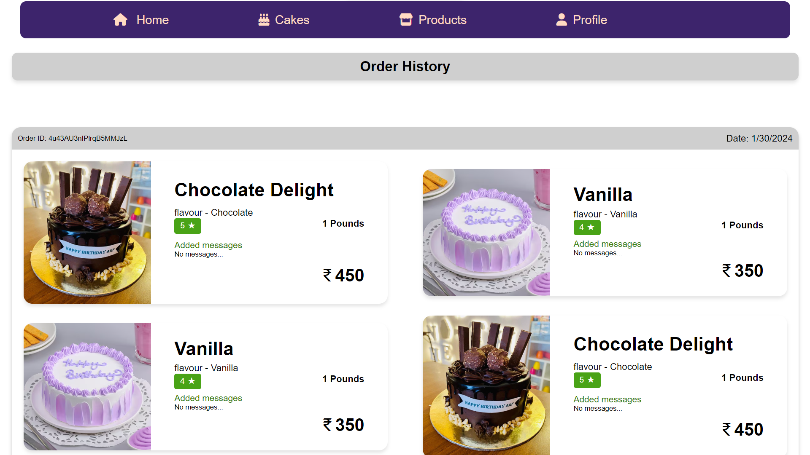

# Voice Controlled News website

A customized full stack website designed to empower cake bussiness to expand their online presence and streamline customer orders. With a user-friendly interface and seamless functionality,The platform enables them to showcase their products, engage customers, and efficiently manage their online shop.

## Demo
#### Main Page

#### Filter options

#### Easy adding with customization

#### Order tracking

## Usage

#### 
- Browse through a variety of bakery products showcased with stunning visuals.
- Customize orders with ease, offering customers the flexibility to tailor their selections.
- Place orders seamlessly, enhancing the shopping experience for customers.
- Manage the bakery's online shop effortlessly, ensuring smooth operations and satisfied customers.

## Features

- Responsive design: Access seamlessly across various devices for a consistent user experience.
- Clean and modern design to captivate visitors and enhance user experience.
- Intuitive navigation for effortless browsing and ordering.
- Easy to track the stock and Manage warehouse by the admin using the admin panel.

## Tech Stack

- React.js
- Node.js
- Tailwind CSS
- Express 
- Firebase

## Contributing

Contributions are always welcome! 😊😊✨

## Contact

If you have any suggestions or query

Feel free to Contact me at

utsavladia@gmail.com

https://www.linkedin.com/in/utsav-ladia

